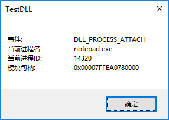
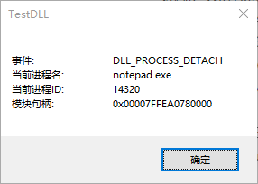

# RemoteInjectDLL
  x86与x64通用的远程注入DLL、远程卸载DLL。

## 函数说明
  RemoteInjectDLL.h里
```cpp
//注入DLL并返回模块句柄
HMODULE	RemoteInjectDLL	(DWORD pid, const char* path);
BOOL	RemoteFreeDLL	(DWORD pid, HMODULE hModule);
```

## 依赖
  依赖Windows.h、STL(c++11及其以上)

## 代码目录结构
```
XunYouDNSProxy
|
└───pic							测试图片
|
└───Test						注入程序EXE
|	|	
|	|	RemoteInjectDLL.cpp		核心文件
|	|	RemoteInjectDLL.h		核心文件
|	|	Test.cpp				main函数
|
└───TestDLL						被注入的DLL
|	|
|	|	dllmain.cpp				DllMain函数
|
|	RemoteInjectDLL.sln
|   README.md
```

## 编译
  以Release-x86或Release-x64编译，x64编译出的二进制文件以x64为结尾。编译后目录结构如下：
```
bin
|
|	Test.exe					32位版本EXE
|	Test64.exe					64位版本EXE
|	TestDLL.dll					32位版本DLL
|	TestDLL64.dll				64位版本DLL
```
  32位EXE注入32位DLL到32位进程，64位的EXE注入64位的DLL到64位进程。
## 测试方式
 **注意：DLL和EXE必须同目录**
- 环境：Win10x64
- 注入器：Test64.exe
- DLL：TestDLL64.dll
- 目标进程：notepad.exe(x64)，进程ID14320
-  运行EXE，输入进程ID并键入回车，会注入notepad.exe并弹出信息框
```bash
输入进程ID:14320
注入 F:/github/RemoteInjectDLL/bin/TestDLL64.dll 到进程 14320
```


- 关掉信息框，此时exe里会返回模块句柄
```bash
输入进程ID:14320
注入 F:/github/RemoteInjectDLL/bin/TestDLL64.dll 到进程 14320
模块句柄:00007FFEA0780000
任意键卸载DLL
请按任意键继续. . .
```
-  键入任意键，此时会卸载DLL，弹出信息框



- 关掉信息框，此时EXE会返回
```bash
输入进程ID:14320
注入 F:/github/RemoteInjectDLL/bin/TestDLL64.dll 到进程 14320
模块句柄:00007FFEA0780000
任意键卸载DLL
请按任意键继续. . .
卸载DLL完毕
请按任意键继续. . .
```